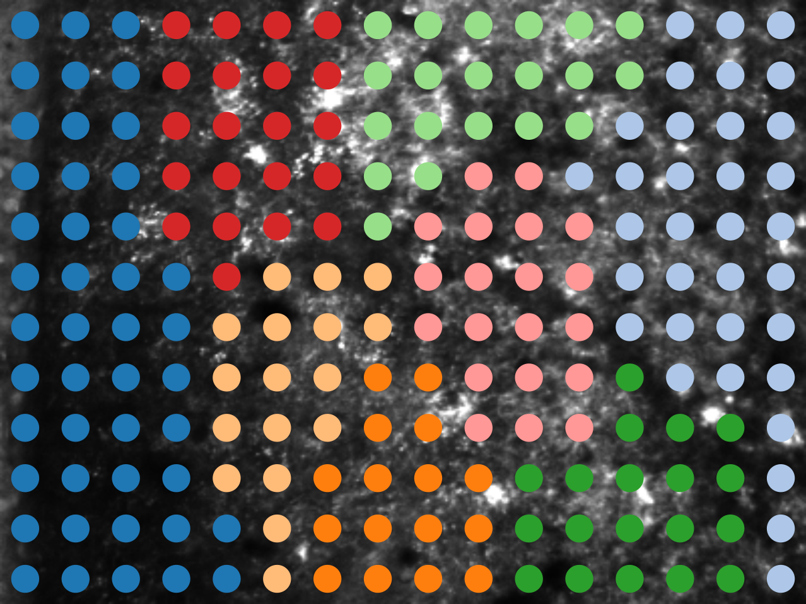
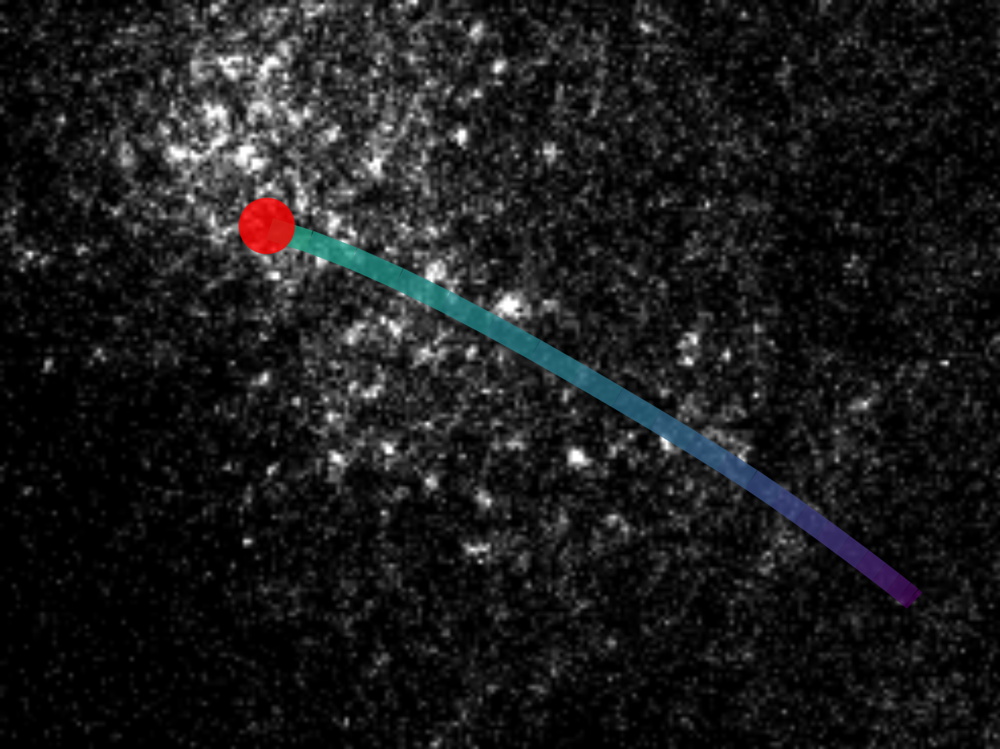

# Dunnart neural activity analysis
Jupyter notebook and Python code for the analysis of neuronal ensembles and travelling waves in the cerebral cortex of the fat-tailed dunnart from calcium imaging data, as published in our study:

> Suárez, R. et al. Cortical activity emerges in region-specific patterns during early brain development. 2023.02.18.529078, Preprint at https://doi.org/10.1101/2023.02.18.529078 (2023).

 &emsp; 

## Overview
This repository contains:
* The Jupyter notebook `dunnart_analysis.ipynb` which runs the complete pipeline for analysing the calcium imaging data, generating results and rendering figures for our published study.
* Custom modules called from the notebook including:
  * `caimaging/tools` for extracting neural activity from 2D calcium imaging data using an ROI grid.
  * `fcnetwork/ggm`,`networkviz` and `stats` for estimating functional connectivity between ROIs using Gaussian graphical modelling and qunatifying properties of neuronal ensembles and network structure.
  * `wavetrack/wave_cc`, `wave_viz` and `direction_stats` for tracking and analysing properties of travelling wave activity.

## Installation and usage
To run the notebook (or use the custom functions on your own data):
1. Clone the repository.
1. Install the environment with `conda` using the included YAML file.
``` 
conda env create -f dunnart_analysis.yml
```
1. Download the data (see Data availability).
1. Set the `datapath`, `scratchpath` and `figpath` environment variables in the second code block of the notebook. The `datapath` must point to the `raw-2p` folder in the downloaded data. Create directories for `figpath` and `scratchpath` as necessary.
1. Run all cells in order.

## Data availability
The data for this project are available for download at: \[TBC\]

## References
Please see the companion paper linked above for details of the methods and packages used in this code.

## Citing this code
If you use or adapt our code or methods in your research, please cite the companion paper linked above or as shown here in BibTeX format:
```
@article {suarez_cortical_2023,
	author = {Rodrigo Su{\'a}rez and Tobias Bluett and Michael H. McCullough and Lilach Avitan and Dylan A. Black and Annalisa Paolino and Laura R. Fenlon and Geoffrey J. Goodhill and Linda J. Richards},
	title = {Cortical activity emerges in region-specific patterns during early brain development},
	elocation-id = {2023.02.18.529078},
	year = {2023},
	doi = {10.1101/2023.02.18.529078},
	publisher = {Cold Spring Harbor Laboratory},
	journal = {bioRxiv}
}
```

## Questions
Please email michael.mccullough@anu.edu.au if you have questions about the code.
